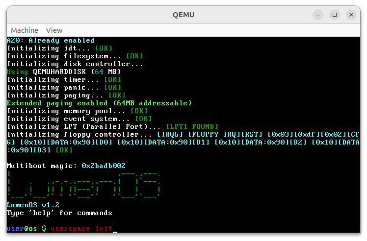

LumenOS
===============================================================================

**32 Bit OS written in C & Assembly**

*LumenOS using Limine Bootloader*

*Features:*
- Basic I/O system -- DONE
- Console -- DONE
- File System -- DONE
- Memory Managment -- DONE
- Multitasking -- SOON
- Panic handlers -- IN PROGRESS
- Power Managment -- DONE
- System logging -- DONE
- Timers -- DONE
- Simple BASIC -- DONE
- PCI devices detecting -- DONE
- Ring Buffer -- DONE
- Memory Pool -- DONE
- Event System -- DONE

*Drivers:*
- Disk driver -- DONE
- Serial driver -- DONE
- Speaker driver -- DONE
- Vga (graphics) -- DONE
- A20 mode -- DONE
- Floppy disk -- UNSTABLE
- LPT driver -- DONE

*Included apps:*
- ASCII table
- Calculator
- Clock
- Memory Map
- Spreadsheet editor
- System info
- Text Editor

**Building & Running**

To build *LumenOS* you need to install some packages:

> sudo apt-get install nasm xorriso make gcc build-essential qemu

Then execute:

> make clean && make all

And run:

> make run
